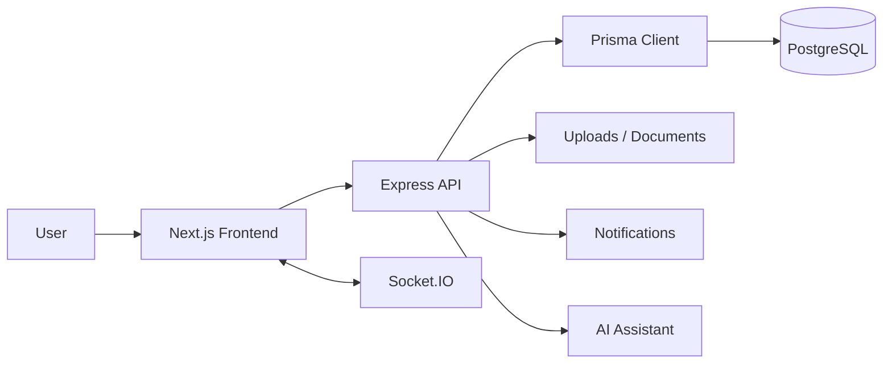

# MediHub ✨

MediHub is a full-stack medical learning and collaboration platform built with Next.js 14, Express, Prisma, PostgreSQL, and Socket.IO.

</details>

## Overview 🔎

MediHub brings together the tools medical students, doctors, researchers, and educators need in one place. The app combines a polished landing experience with authenticated workspace features for learning, collaboration, communication, and career growth.

<details>
<summary>What the app covers</summary>

- 📰 Medical news browsing and trending topics
- 📅 Event discovery, registration, and Eventbrite sync support
- 📝 Notebook workspace for subjects, notes, blocks, and tasks
- 🫶 Social feed for posts, likes, bookmarks, reposts, and comments
- 👥 Community groups with threads, replies, votes, and resources
- 💬 Real-time chat with files, join requests, and pinned conversations
- 🤖 AI assistant for questions, document summaries, and extracted text
- 🔔 Notifications for chat, groups, events, and system actions
- 💼 Opportunities and applications for medical roles and internships

</details>

## What Changed 🚀

This version moves the backend from MongoDB/Mongoose to PostgreSQL with Prisma and Docker-based local database setup.

- 🐘 PostgreSQL replaces MongoDB as the main database
- 🧩 Prisma is used for schema management, queries, and migrations
- 🐳 Docker Compose is provided for local PostgreSQL startup
- 🎨 The frontend UI has been refreshed with a cleaner landing page, updated navigation, responsive cards, and a more polished visual system
- ⚡ Real-time chat, notifications, AI assistant, notebook, events, groups, opportunities, and feed features are wired into the current app structure

## Architecture 🏗️



The frontend handles the UI, routing, and client-side state. The backend provides the API, authentication, real-time messaging, and file/document workflows. Prisma connects the backend to PostgreSQL, and Docker provides a local database container for development.

## Feature Tour 🧭

<details open>
<summary>Core product modules</summary>

| Area | What it does |
| --- | --- |
| 📰 News | Lists medical news, supports cache refresh, and exposes trending topics |
| 📅 Events | Lists events, registers users, creates events, and supports Eventbrite syncing |
| 📝 Notebook | Manages subjects, notes, note blocks, reorder actions, and tasks |
| 🫶 Feed | Supports posts, likes, bookmarks, reposts, comments, and image uploads |
| 👥 Groups | Handles communities, members, threads, replies, votes, pins, and resources |
| 💬 Chat | Supports conversations, direct and group chat, file messages, and join requests |
| 🤖 Assistant | Lets users chat with AI, summarize docs, extract text, and save message history |
| 🔔 Notifications | Tracks unread counts, read states, and bulk clearing |
| 💼 Opportunities | Lists roles, filters, applications, and user submissions |
| 👤 Users | Handles register, login, profile fetch, and protected user listing |

</details>

## UI Tour 🎨

The current frontend is not just functional; it is visually structured to feel like a complete product.

<details>
<summary>UI highlights</summary>

- ✨ A redesigned landing page with a stronger brand presence and feature-led storytelling
- 🧭 A sticky navigation bar with app shortcuts and notification controls
- 📱 Dedicated app pages for home, feed, events, groups, chat, notebook, assistant, opportunities, login, and signup
- 🎛️ A clearer visual language with refined spacing, cards, borders, shadows, and color system
- 📐 Responsive layouts that adapt to desktop and mobile screens
- 🤖 An assistant workspace with document upload, summary generation, and message history

</details>

### Frontend pages

| Route | Purpose |
| --- | --- |
| `/` | Public landing page |
| `/login` | Sign in page |
| `/signup` | Sign up page |
| `/home` | Main authenticated dashboard |
| `/feed` | Community feed |
| `/events` | Events page |
| `/groups` | Communities and threads |
| `/chat` | Messaging |
| `/notebook` | Notes and tasks |
| `/assistant` | AI assistant |
| `/opportunities` | Roles and applications |

## Project Structure 🗂️

| Path | Role |
| --- | --- |
| `frontend/` | Next.js app and UI |
| `backend/` | Express API, Prisma schema, routes, controllers, and utilities |
| `docker-compose.yml` | Local PostgreSQL container |
| `backend/prisma/` | Prisma schema and migrations |
| `backend/uploads/` | Stored uploaded files |

## Local Setup 🛠️

### Prerequisites ✅

- Node.js 18+ recommended
- npm
- Docker Desktop or another Docker runtime
- (Optional) [Ollama](https://ollama.com) running locally if you want to use the AI assistant. Pull the default model with `ollama pull smollm:1.7b`.

### 1. Install dependencies 📦

From the repository root:

```bash
npm run install:all
```

This installs root, frontend, and backend dependencies.

### 2. Configure environment variables 🔐

```bash
cp backend/.env.example backend/.env
```

Then open `backend/.env` and set at minimum:

- `JWT_SECRET` — any long random string
- `EVENTBRITE_TOKEN` / `NEWS_API_KEY` — optional, leave blank to disable events / news fetching

The default `DATABASE_URL` matches the Docker Compose setup below.

### 3. Start PostgreSQL with Docker 🐳

```bash
docker compose up -d
```

This starts the PostgreSQL container defined in `docker-compose.yml` on port `5432`.

### 4. Apply database migrations 🧩

From the `backend/` folder:

```bash
npx prisma migrate deploy
npx prisma generate
```

(Use `npx prisma migrate dev` instead if you intend to author new migrations.)

### 5. Run the app ▶️

From the repository root:

```bash
npm run dev
```

That starts the frontend on `http://localhost:3000` and the backend on `http://localhost:5000`.

## Deployment 🚀

### 1. Database

Prisma is the ORM, not the database itself. For production, use a hosted PostgreSQL database and point `DATABASE_URL` at it. Prisma Postgres, Neon, Supabase, and Render Postgres all work.

### 2. Backend on Render

Deploy the `backend/` folder as a Render Web Service.

- Build command: `npm install && npx prisma generate`
- Start command: `npm start`
- Health check path: `/api/health`

Set these environment variables on Render:

- `DATABASE_URL`
- `JWT_SECRET`
- `AI_PROVIDER=gemini`
- `GEMINI_API_KEY`
- `GEMINI_MODEL` if you want to change the default model
- `EVENTBRITE_TOKEN` if you use events
- `NEWS_API_KEY` if you use news

### 3. Frontend on Vercel

Deploy the `frontend/` folder as a Vercel Next.js project.

Set these environment variables on Vercel:

- `NEXT_PUBLIC_API_URL=https://your-backend.onrender.com/api`
- `NEXT_PUBLIC_SOCKET_URL=https://your-backend.onrender.com`
- `NEXT_PUBLIC_BACKEND_URL=https://your-backend.onrender.com`

If you want the uploaded files and chat attachments to work in production, make sure the backend Render service is publicly reachable and serves `/uploads`.

## Scripts ⚙️

### Root scripts 🧰

| Command | Purpose |
| --- | --- |
| `npm run install:all` | Install frontend and backend dependencies |
| `npm run dev:frontend` | Start the frontend only |
| `npm run dev:backend` | Start the backend only |
| `npm run dev` | Run both apps together |

### Frontend scripts 🎯

| Command | Purpose |
| --- | --- |
| `npm run dev` | Start Next.js in development mode |
| `npm run build` | Build the frontend |
| `npm run start` | Start the production build |
| `npm run lint` | Lint the frontend |

### Backend scripts 🖥️

| Command | Purpose |
| --- | --- |
| `npm run dev` | Start the Express server with nodemon |
| `npm start` | Start the Express server |

## API Surface 🔌

### Authentication and users 👤

- `POST /api/users/register`
- `POST /api/users/login`
- `GET /api/users/me`
- `GET /api/users`

### Feed 📰

- `GET /api/posts`
- `POST /api/posts`
- `PUT /api/posts/:id/like`
- `PUT /api/posts/:id/bookmark`
- `POST /api/posts/:id/comments`
- `DELETE /api/posts/:postId/comments/:commentId`
- `POST /api/posts/:id/repost`
- `DELETE /api/posts/:id`

### Notes and tasks 📝

- `GET /api/notes`
- `POST /api/notes`
- `PUT /api/notes/reorder`
- `PUT /api/notes/:id`
- `DELETE /api/notes/:id`
- `GET /api/notes/subjects`
- `POST /api/notes/subjects`
- `PUT /api/notes/subjects/:name`
- `DELETE /api/notes/subjects/:name`
- `GET /api/tasks`
- `POST /api/tasks`
- `PUT /api/tasks/:id/toggle`
- `DELETE /api/tasks/:id`

### Events 📅

- `GET /api/events`
- `POST /api/events`
- `PUT /api/events/:id/register`
- `DELETE /api/events/:id`
- `GET /api/events/eventbrite`
- `POST /api/events/eventbrite/refresh`

### Documents and AI 🤖

- `GET /api/documents`
- `POST /api/documents`
- `GET /api/documents/:id/download`
- `DELETE /api/documents/:id`
- `POST /api/ai/chat`
- `POST /api/ai/summarize`
- `POST /api/ai/suggestions`
- `POST /api/ai/extract-text`
- `GET /api/ai/messages`
- `POST /api/ai/messages`
- `DELETE /api/ai/messages`

### Chat 💬

- `GET /api/chat/conversations`
- `POST /api/chat/conversations/private`
- `POST /api/chat/conversations/group`
- `PUT /api/chat/conversations/:id/pin`
- `DELETE /api/chat/conversations/:id`
- `POST /api/chat/conversations/:id/members`
- `DELETE /api/chat/conversations/:id/members/:userId`
- `GET /api/chat/conversations/:id/messages`
- `POST /api/chat/conversations/:id/messages`
- `POST /api/chat/conversations/:id/files`
- `GET /api/chat/conversations/:id/files`
- `GET /api/chat/users/search`
- `GET /api/chat/join-requests`
- `POST /api/chat/conversations/:id/join-request`
- `PUT /api/chat/join-requests/:id`

### Groups 👥

- `GET /api/groups`
- `POST /api/groups`
- `PUT /api/groups/:id`
- `POST /api/groups/:id/join`
- `DELETE /api/groups/:id/leave`
- `GET /api/groups/:id/members`
- `POST /api/groups/:id/members`
- `DELETE /api/groups/:id/members/:userId`
- `GET /api/groups/:id/threads`
- `POST /api/groups/:id/threads`
- `PUT /api/groups/threads/:threadId/vote`
- `PUT /api/groups/threads/:threadId/pin`
- `GET /api/groups/threads/:threadId/replies`
- `POST /api/groups/threads/:threadId/replies`
- `GET /api/groups/:id/resources`
- `POST /api/groups/:id/resources`
- `PUT /api/groups/resources/:resourceId/download`

### Notifications, news, and opportunities 🔔

- `GET /api/notifications`
- `GET /api/notifications/unread-count`
- `PUT /api/notifications/read-all`
- `PUT /api/notifications/:id/read`
- `DELETE /api/notifications`
- `GET /api/news`
- `POST /api/news/refresh`
- `GET /api/news/trending`
- `GET /api/opportunities`
- `POST /api/opportunities`
- `GET /api/opportunities/filters`
- `GET /api/opportunities/applications`
- `POST /api/opportunities/:id/apply`
- `DELETE /api/opportunities/:id`

## Database and Prisma 🐘

Prisma is the source of truth for the schema in `backend/prisma/schema.prisma`.

- PostgreSQL is the active database provider
- Relations are modeled through Prisma instead of Mongoose collections
- Migrations live under `backend/prisma/migrations/`
- The backend connects to PostgreSQL through Prisma on startup

### Data model highlights 🧠

<details>
<summary>Main entities</summary>

- Users and auth
- Posts, comments, likes, bookmarks, and reposts
- Notes, note blocks, and subjects
- Tasks and event registrations
- Conversations, members, messages, and join requests
- Notifications and AI chat messages
- Documents, opportunities, applications, and groups

</details>

## Troubleshooting 🧯

<details>
<summary>Common issues</summary>

- If the backend cannot connect, verify `DATABASE_URL` and that Docker is running.
- If Prisma schema changes are not visible, rerun `npx prisma generate` and `npx prisma migrate dev`.
- If the frontend cannot reach the backend, check the backend port and any local proxy or firewall rules.
- If uploads fail, confirm the `backend/uploads/` directory exists and the file size is within the configured limit.
- If Socket.IO chat is not connecting, verify the JWT token and backend server startup.

</details>

## Next Improvements 🌱

Potential production follow-ups:

- 🔑 Add deployment-specific environment files and secrets handling
- 🛡️ Harden authentication and session management
- ☁️ Add file storage backed by cloud object storage
- 🧪 Expand validation and error handling
- ✅ Add CI checks for Prisma migrations and frontend linting
- 🚀 Deploy the frontend and backend with managed PostgreSQL
